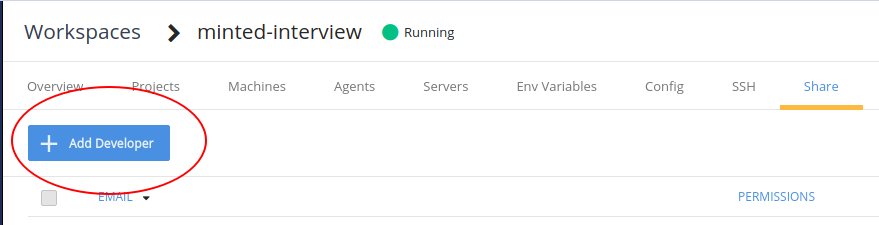

## Overview

This repo is a playground of different semi-realistic coding exercises that we hope provides an interviewer the opportunity to explore how a candidate thinks about software and to work through some of it together.

## Getting started

Click the Codenvy button to launch a cloud development environment and run this project.

## Sharing

To share your workspace with another Developer, click the Workspaces navigation item on the left panel, select the interview workspace, then click "Add Developer."

